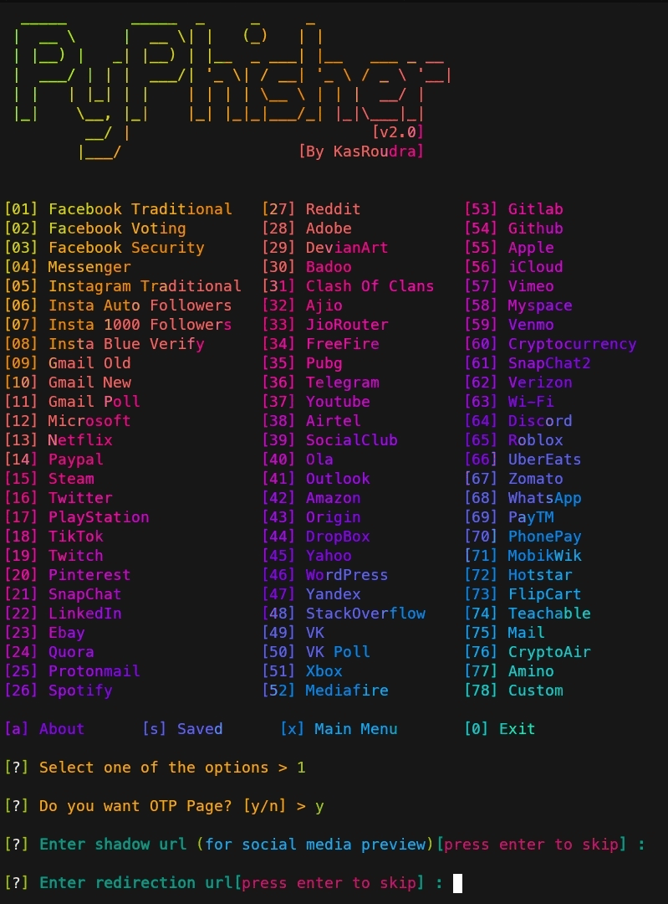

<h1 align="center">PyPhisher</h1>

<p align="center">
  
  
  
  
     
<br>
<br>
  
  
  
  
</p>


### [+] Description :

***Ultimate phishing tool in python. Includes popular websites like facebook, twitter, instagram, github, reddit, gmail and many others.***

### [+] Installation

##### Install primary dependencies (git and python)

 - For Debian
    - ```sudo apt install git python -y```
 - For Arch
    - ```sudo pacman -S git python --noconfirm```
 - For Fedora
    - ```sudo yum install git python -y```
 - For Termux
    - ```pkg install git python -y```

##### Clone this repository

 - ```git clone https://github.com/KasRoudra/PyPhisher```

##### Enter the directory
 - ```cd PyPhisher```

##### Run the tool
 - ```python3 pyphisher.py```

#### Or, directly run
```
wget https://raw.githubusercontent.com/KasRoudra/PyPhisher/main/pyphisher.py && python3 pyphisher.py

```

### Features:

 - Multi platform (Supports most linux)
 - 63 Website templates
 - Dual Tunneling (Ngrok and Cloudflared)
 - Easy to use
 - Possible error diagnoser
 - Built-in masking of url
 - Custom masking of url
 - Portable file (Can be run from any directory)
 - Get IP Address and many other details along with login credentials

### Requirements

 - `Python(3)`
 - `PHP`
 - `Curl`
 - `Unzip`
 - `Wget`
 - 90MB storage (All files from git clone)
 - 60MB storage (Direct run script without git clone)
 
If not found, all of the required packages will be installed on first run

#### Tested on

 - `Termux`
 - `Kali-Linux`

## Usage

1. Run the script
2. Choose a Website
3. Wait sometimes for setting up all
4. Send the generated link to victim
5. Wait for victim login. As soon as he/she logs in, credentials will be captured

<h1 align="center">Example</h1>



## Video Tutorial
<a href="https://rebrand.ly/pyphishervideo">PyPhisher Video</a>

## [+] Disclaimer
***This tool is developed for educational purposes. Here it demonstrates how phishing works. If anybody wants to gain unauthorized access to someones social media, he/she may try out this at his/her own risk. You have your own responsibilities and you are liable to any damage or violation of laws by this tool. The author is not responsible for any misuse of PyPhisher!***

### This repository is open source to help others. So if you wish to copy, consider giving credit!

## Credits: <a href="https://github.com/htr-tech/zphisher">HTR-Tech</a> and <a href="https://github.com/jaykali/maskphish">JayKali</a>

####  If this tool helped you, consider staring repository. Your stars encourage me a lot!

## [+] Find Me on :
<ul>
<li><a href="https://facebook.com/KasRoudra"></a></li>
<li><a href="https://m.me/KasRoudra"></a></li>
<li><a href="mailto://kasroudrard@gmail.com"></a></li>
</ul>
